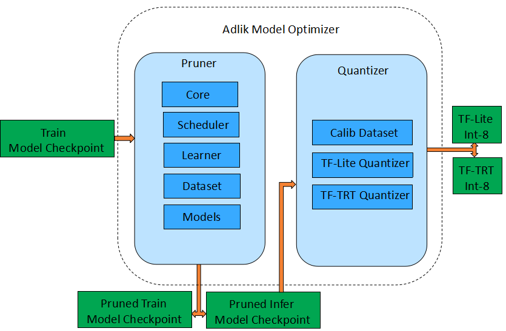
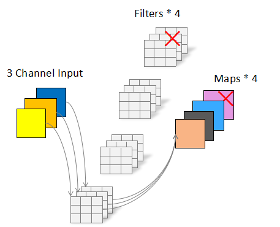
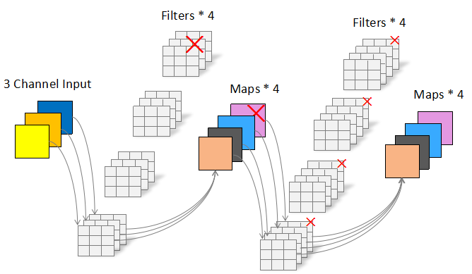
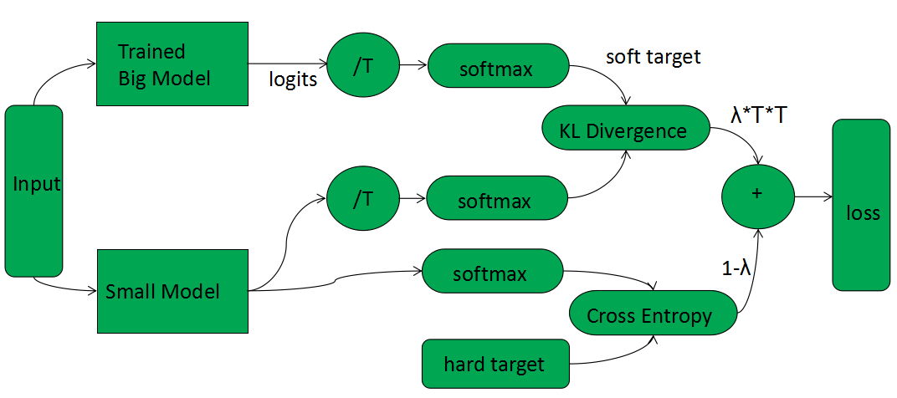

# Model Optimizer

[](https://dev.azure.com/Adlik/GitHub/_build/latest?definitionId=2&branchName=master)
[](https://app.bors.tech/repositories/23640)

Adlik model optimizer, focusing on and running on specific hardware to achieve the purpose of acceleration. Because
sparsity pruning depends on special algorithms and hardware to achieve acceleration, the usage scenarios are limited.
Adlik pruning focuses on channel pruning and filter pruning, which can really reduce the number of parameters and
flops. In terms of quantization, Adlik focuses on 8-bit quantization that is easier to accelerate on specific hardware.
After testing, it is found that running a small batch of datasets can obtain a quantitative model with little loss of
accuracy, so Adlik focuses on this method. Knowledge distillation is another way to improve the performance of deep 
learning algorithm. It is possible to compress the knowledge in the big model into a smaller model.

The proposed framework mainly consists of two categories of algorithm components, i.e. pruner and quantizer. The
pruner is mainly composed of five modules:core, scheduler, models, dataset and learner. The core module defines
various pruning algorithms. The scheduler is responsible for the orchestration of each pruning algorithm process.
The models module is responsible for the network definition of each model. The dataset module is responsible for
the data loading and preprocessing. The learner is responsible for model training and fine-tuning, including the
definition of each hyper-parameter. The quantizer includes calibration dataset, TF-Lite and TF-TRT quantization
three modules.


After filter pruning, model can continue to be quantized, the following table shows the accuracy of the pruned and
quantized Lenet-5 and ResNet-50 models.

| model     | baseline | pruned               | pruned+quantization(TF-Lite) | pruned+quantization(TF-TRT) |
| --------- | -------- | -------------------- | ---------------------------- | --------------------------- |
| LeNet-5   | 98.85    | 99.11(59% pruned)    | 99.05                        | 99.11                       |
| ResNet-50 | 76.174   | 75.456(31.9% pruned) | 75.158                       | 75.28                       |

The Pruner completely removes redundant parameters, which further leads to smaller model size and faster execution.
The following table is the size of the above model files:

| model     | baseline(H5) | pruned(H5)         | quantization(TF-Lite) | quantization(TF-TRT) |
| --------- | ------------ | ------------------ | --------------------- | -------------------- |
| LeNet-5   | 1176KB       | 499KB(59% pruned)  | 120KB                 | 1154KB (pb)          |
| ResNet-50 | 99MB         | 67MB(31.9% pruned) | 18MB                  | 138MB(pb)            |

Knowledge distillation is an effective way to imporve the performance of model.

The following table  shows the distillation result of  ResNet-50 as the student network where ResNet-101 as the teacher network.

| student model | ResNet-101 distilled | accuracy change |
| ------------- | -------------------- | --------------- |
| ResNet-50     | 77.14%               | +0.97%          |


## 1. Pruning and quantization principle

### 1.1 Filter pruning

Filter pruning is to cut out a complete filter. After cutting out the filter, the corresponding output feature map
will be cut out accordingly. As shown in the following figure, after cutting out a Filter, the original output of
four feature maps becomes three feature maps.



If there is another convolution layer behind this convolution layer, because the next layer's input is now has fewer
channels, we should also shrink the next layer's weights tensors, by removing the channels corresponding to the
filters we pruned. As shown below, Each filter of the next convolutional layer originally had four Channels, which
should be changed to three Channels accordingly.



Refer to the paper [PRUNING FILTERS FOR EFFICIENT CONVNETS
](https://arxiv.org/pdf/1608.08710.pdf)

### 1.2 Quantization

Compared to the quantization in the training phase, a description of the training model and a full data set are
required. It takes a lot of computing power to complete the quantification of the large model. Small batch dataset
quantization, only need to have inference model and very little calibration data to complete, and the accuracy loss
of quantization is very small, and even some models will rise. Adlik only needs 100 sample images to complete the
quantification of ResNet-50 in less than one minute.

### 1.3 Knowledge Distillation

Knowledge distillation is a compression technique by which the knowledge of a larger model(teacher) is transfered into
a smaller one(student). During distillation, a student model learns from a teacher model to generalize well by raise
the temperature of the final softmax of the teacher model as the soft set of targets. 



Refer to the paper [Distilling the Knowledge in a Neural Network](https://arxiv.org/pdf/1503.02531.pdf)


## 2. Installation

These instructions will help get Adlik optimizer up and running on your local machine.

1. [Clone Adlik model optimizer](#Clone-Adlik-model-optimizer)
2. [Install the package](#Install-the-package)

Notes:

- Adlik model optimizer has only been tested on Ubuntu 18.04 LTS with Python 3.6.

### 2.1 Clone Adlik model optimizer

Clone the Adlik model optimizer code repository from github:

```shell
git clone https://github.com/Adlik/model_optimizer.git
```

### 2.2 Install the package

#### 2.2.1 Install Open MPI

```shell
mkdir /tmp/openmpi && \
cd /tmp/openmpi && \
curl -fSsL -O https://www.open-mpi.org/software/ompi/v4.0/downloads/openmpi-4.0.0.tar.gz && \
tar zxf openmpi-4.0.0.tar.gz && \
cd openmpi-4.0.0 && \
./configure --enable-orterun-prefix-by-default && \
make -j (nproc) all && \
make install && \
ldconfig && \
rm -rf /tmp/openmpi
```

#### 2.2.2 Install python package

```shell
pip install tensorflow-gpu==2.1.0
pip install horovod==0.19.1
pip install mpi4py
pip install networkx
pip install jsonschema
```

## 3. Usage

The following uses LeNet-5 on the MNIST dataset to illustrate how to use Adlik model optimizer to achieve model
training, pruning, and quantization.

### 3.1 Prepare data

#### 3.1.1 Generate training and test datasets

Enter the tools directory and execute

```shell
cd tools
python export_mnist_to_tfrecord.py
```

By default, the train.tfrecords and test.tfrecords files will be generated in the ../examples/data/mnist directory.
You can change the default storage path with the parameter --data_dir.

#### 3.1.2 Generate small batch data sets required for int-8 quantization

Enter the tools directory and execute

```shell
cd tools
python generator_tiny_record_mnist.py
```

By default, the mnist_tiny_100.tfrecord file will be generated in the ../examples/data/mnist_tiny directory.

### 3.1.3 Training

Enter the examples directory and execute

```shell
cd examples
python lenet_mnist_train.py
```

After execution, the default checkpoint file will be generated in ./models_ckpt/lenet_mnist, and the inference
checkpoint file will be generated in ./models_eval_ckpt/lenet_mnist. You can also modify the checkpoint_path and
checkpoint_eval_path of the lenet_mnist_train.py file to change the generated file path.

### 3.1.4 Pruning

Enter the examples directory and execute

```shell
cd examples
python lenet_mnist_prune.py
```

After execution, the default checkpoint file will be generated in ./models_ckpt/lenet_mnist_pruned, and the inference
checkpoint file will be generated in ./models_eval_ckpt/lenet_mnist_pruned. You can also modify the checkpoint_path
and checkpoint_eval_path of the lenet_mnist_train.py file to change the generated file path.

### 3.1.5 Quantize and generate a TensorFlow Lite FlatBuffer file

Enter the examples directory and execute

```shell
cd examples
python lenet_mnist_quantize_tflite.py
```

After execution, the default checkpoint file will be generated in ./models_ckpt/lenet_mnist_pruned, and the tflite
file will be generated in ./models_eval_ckpt/lenet_mnist_quantized. You can also modify the export_path of the
lenet_mnist_quantize.py file to change the generated file path.

You can enter the tools directory and execute

```shell
cd tools
python tflite_model_test_lenet_mnist.py
```

Verify accuracy after quantization

### 3.1.6 Quantize and generate a TensorFlow with TensorRT (TF-TRT) file

Enter the examples directory and execute

```shell
cd examples
python lenet_mnist_quantize_tftrt.py
```

After execution, the savedmodel file will be generated in ./models_eval_ckpt/lenet_mnist_quantized/lenet_mnist_tftrt/1
by default. You can also modify the export_path of the lenet_mnist_quantize.py file to change the generated file path.
You can enter the directory and execute

```shell
cd tools
python tftrt_model_test_lenet_mnist.py
```

Verify accuracy after quantization

## 4. Others

If you have a GPU that can be used for training acceleration, you can test the pruning and quantization for ResNet-50.
This step is the same as described above. You can get detailed instructions from [here](doc/ResNet-50-Traing-Pruning.md).

### 4.1 Use multiple GPUs

```shell
     cd examples
     horovodrun -np 8 -H localhost:8 python resnet_50_imagenet_train.py
```

### 4.1 Adjust batch size and learning rate

Batch size is an important hyper-parameter for Deep Learning model training. If you have more GPU memory available,
you can try larger batch size! You have to adjust the learning rate according to different batch size.

| model     | card      | batch size | learning-rate |
| --------- | --------- | ---------- | ------------- |
| ResNet-50 | V100 32GB | 256        | 0.1           |
| ResNet-50 | P100 16GB | 128        | 0.05          |
