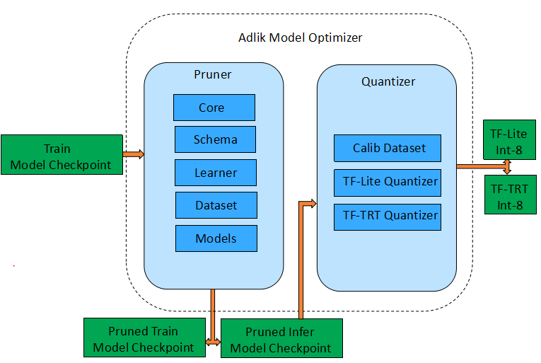
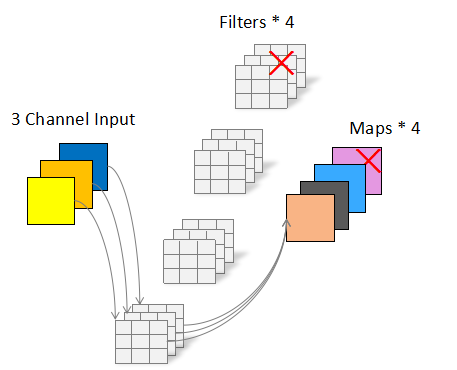
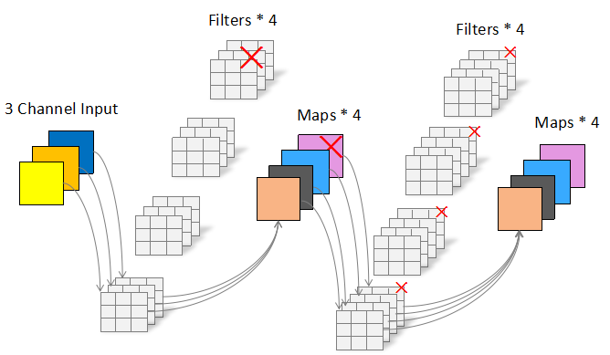

# Model optimizer

Adlik model optimization, focusing on and running on specific hardware to achieve the purpose of acceleration. Because sparsity pruning depends on special algorithms and hardware to achieve acceleration, the usage scenarios are limited. Adlik pruning focuses on channel pruning and filter pruning, which can really reduce the number of parameters and flops. In terms of quantization, Adlik focuses on 8-bit quantization because it is easier to accelerate on specific hardware. After testing, it is found that running a small batch of data sets can obtain a quantitative model with little loss of accuracy, so Adlik focuses on this method.

The proposed framework mainly consists of two categories of algorithm components, i.e. pruner and quantizer. The pruner is mainly composed of core, schema, models, dataset, learner modules. The core module defines various pruning algorithms. The schema is responsible for the orchestration of each pruning algorithm process, the models module are responsible for the network definition of each model, the dataset is responsible for the data set, the learner is responsible for the training or finetune of each model, including the definition of each hyper-parameter. The Quantizer includes calibration dataset, TF-Lite and TF-TRT quantization module.


After filter pruning, model can continue to be quantized, the following table shows the accuracy of the pruned and quantized Lenet-5 and resnet-50 models.

|   model   | baseline |       pruned       | pruned+quantizetion(TF-Lite) | pruned+quantizetion(TF-TRT) |
| --------- | -------- | ------------------ | ---------------------------- | --------------------------- |
| lenet-5   | 98.85    | 99.11(59% pruned)  | 99.05                        | 99.11                       |
| resnet-50 | 76.188   | 75.504(33% pruned) | 74.978                       | 75.222                      |

The Pruner completely removes redundant parameters, which further leads to smaller model size and faster execution. The following table is the size of the above model files:
|   model   | baseline |       pruned       | quantizetion(TF-Lite) | quantizetion(TF-TRT) |
| --------- | -------- | ------------------ | --------------------- | -------------------- |
| lenet-5   | 1205112    |510528(59% pruned)  | 123232                 | 1182477 (pb)                |
| resnet-50 | 102937780    | 68830728(33% pruned) | 18868008                | 151270821 (pb)               |

## 1. Pruning and quantization principle

### 1.1 Filter pruning
Filter pruning is to cut out a complete filter. After cutting out the filter, the output of this convolutional layer will be cut out accordingly. As shown in the following figure, after cutting out a Filter, the original output of 4 feature maps becomes the output of three feature maps.


If there is another convolution layer behind this convolution layer, because the next layer's input is now has fewer channels, we should also shrink the next layer's weights tensors, by removing the channels corresponding to the filters we pruned. As shown below, Each Filter of the next convolutional layer originally had 4 Channels, which should be changed to 3 Channels accordingly.


Refer to the paper [PRUNING FILTERS FOR EFFICIENT CONVNETS
](https://arxiv.org/pdf/1608.08710.pdf)


### 1.2 Quantization
Compared to the quantization in the training phase, a description of the training model and a full data set are required. It takes a lot of computing power to complete the quantification of the large model. Inference model small batch data set quantization, only need to have inference model and very little calibration data to complete, and the accuracy loss of quantization is very small, and even some models will rise. Adlik only needs 100 sample images, and can complete the quantification of resnet50 in less than 1 minute.

##  2. Installation

These instructions will help get Adlik optimizer up and running on your local machine.
1. [Clone Adlik model optimizer](#Clone-Adlik-model-optimizer)
2. [Install the package](#Install-the-package)

Notes:
- Adlik optimizer has only been tested on Ubuntu 16.04 LTS, and with Python 3.6.

### 2.1 Clone Adlik model optimizer
Clone the Adlik model optimizer code repository from github:
```
$ git clone https://github.com/Adlik/model_optimizer.git
```
### 2.2 Install the package
```shell
$ pip install tensorflow-gpu==2.0.0
$ pip install horovod==0.19.0
$ pip install networkx
$ pip install jsonschema

```

## 3. Usage
The following uses Lenet-5 on the mnist data set to illustrate how to use the model optimizer to achieve model training, pruning, and quantization.
### 3.1 Prepare data
#### 3.1.1 Generate training and test data sets
Enter the tools directory and execute
```shell
$ cd tools
$ python export_mnist_to_tfrecord.py
```
By default, the train.tfrecords and test.tfrecords files will be generated in the ../examples/data/mnist directory. You can change the default storage path with the parameter --data_dir.
#### 3.1.2 Generate small batch data sets required for int-8 quantization
Enter the tools directory and execute
```shell
$ cd tools
$ python generator_tiny_record_mnist.py
```
By default, the mnist_tiny_100.tfrecord file will be generated in the ../examples/data/mnist_tiny directory.
### 3.1.3 Train lenet on mnist
Enter the examples directory and execute
```shell
$ cd examples
$ python lenet_mnist_train.py
```
After execution, the default checkpoint file will be generated in ./models_ckpt/lenet_mnist, and the inference checkpoint file will be generated in ./models_eval_ckpt/lenet_mnist. You can also modify the checkpoint_path and checkpoint_eval_path of the lenet_mnist_train.py file to change the generated file path.
### 3.1.4 Prune lenet on mnist
Enter the examples directory and execute
```shell
$ cd examples
$ python lenet_mnist_prune.py
```
After execution, the default checkpoint file will be generated in ./models_ckpt/lenet_mnist_pruned, and the inference checkpoint file will be generated in ./models_eval_ckpt/lenet_mnist_pruned. You can also modify the checkpoint_path and checkpoint_eval_path of the lenet_mnist_train.py file to change the generated file path.
### 3.1.5 Quantize lenet on mnist and generate a TensorFlow Lite FlatBuffer file
Enter the examples directory and execute
```shell
$ cd examples
$ python lenet_mnist_quantize_tflite.py
```

After execution, the default checkpoint file will be generated in ./models_ckpt/lenet_mnist_pruned, and the tflite file will be generated in ./models_eval_ckpt/lenet_mnist_quantized. You can also modify the export_path of the lenet_mnist_quantize.py file to change the generated file path.

You can enter the tools directory and execute
```shell
$ cd tools
$ python tflite_model_test_lenet_mnist.py
```
Verify accuracy after quantization
### 3.1.6 Quantzie lenet on mnist  and generate a TensorFlow with TensorRT (TF-TRT) file
Enter the examples directory and execute
```shell
$ cd examples
$ python lenet_mnist_quantize_tftrt.py
```
After execution, the savedmodel file will be generated in ./models_eval_ckpt/lenet_mnist_quantized/lenet_mnist_tftrt/1 by default. You can also modify the export_path of the lenet_mnist_quantize.py file to change the generated file path.
You can enter the directory and execute
```shell
$ cd tools
$ python tftrt_model_test_lenet_mnist.py
```
Verify accuracy after quantization

## 4. Others
If you have a GPU that can be used for training acceleration, you can test the pruning and quantization for resnet_50. This step is the same as described above.
### 4.1 Use multiple GPUs
```shell
$ cd examples
$ horovodrun -np 8 -H localhost:8 python resnet_50_imagenet_train.py
```
### 4.1 Adjust batch size and learning rate
Batch size is an important hyper-parameter for Deep Learning model training. If you have more GPU memory available you can try larger sizes! You have to adjust the learning rate according to different batch sizes.

|   model   |   card    | batch size | learning-rate |
| --------- | --------- | ---------- | ------------- |
| resnet-50 | V100 32GB | 256        | 0.1           |
| resnet-50 | P100 16GB | 128        | 0.05          |


[](https://dev.azure.com/Adlik/GitHub/_build/latest?definitionId=2&branchName=master)
[](https://app.bors.tech/repositories/23640)
